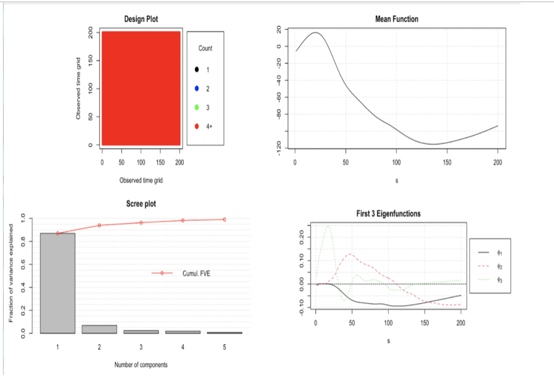
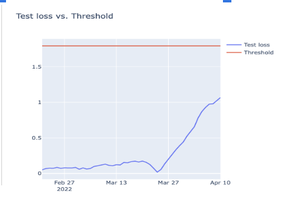

```{r setup, include=FALSE}
knitr::opts_chunk$set(echo = TRUE,out.width="0.9\\linewidth",dev="pdf",fig.align  = 'center')
```

### Introduction
Mechanical loading has been implicated in knee osteoarthritis(OA) pathogenesis, suggesting that interventions aimed at changing joint loading may be key to reducing the burden of knee OA. Knee OA is characterized by radiographic damage and clinical symptoms, particularly knee pain, however, individuals may have knee pain without radiographic damage or vice versa. Traditionally, gait differences among individuals with and without knee OA have been compared using specific, discrete metrics extracted from gait waveforms, such as a peak or impulse.

Our client is focusing on Movement & Applied Imaging Lab and wants to analyze ground reaction force patterns in knees with and without radiographic osteoarthritis and pain.

### Data
The data used in this project is from the Multicenter Osteoarthritis Study(MOST). MOST is a prospective, NIH-funded cohort study of risk factors for the incidence and progression of OA and includes two clinic sites in the United States. Three-dimensional GRF data were recorded at 1,000 Hz using a portable force platform and AccuGait walkway (AMTI Inc., Watertown, MA, USA). Participants walked along the 5.3-m walkway at self-selected speed wearing their own typical footwear. Approximately five trials of GRF data were acquired from each leg of each participant. The first trial for each leg was considered an acclimatization trial and excluded. 

Legs with at least three remaining trials where the foot landed completely on the force plate and a corresponding gait speed measurement was available were retained for analysis. For each leg, raw, unfiltered GRF waveforms were time-normalized to the stance phase of the gait cycle and ensemble averaged across three randomly selected remaining trials.

### Method
## EDA
Firstly,we make plots to see the trends within the time series data.We mainly focused on GRF(ground reaction force) and COP(center of pressure) data and drew the plots with time series using "ggplot" and functional data analysis in R. The reason why we use FDA is that our data is functional data,which means in FDA,we do not interpret our measured data as a sequence of observations,but as a single function or curve.Measurements do not have to be taken at the same point in time to be comparable. This is also a common problem. When our group wanted to compare time-series, the measurements were not taken at the same time. Comparing those would then be problematic. Therefore, we viewed our data as function, comparison became much easier.

We followed with the plot shown in the paper our client provided, drew the line plot in series with first 200 rows in GRF tables selected. Different colors refer to different rows and each row indicates time data of general reaction force for per leg per trial of one person. 

## FPCA
Next, we did functional principal components analysis on Vertical GRF waveforms and GRFx data sets in order to find the principal components for each data set. FPCA is based on principal component analysis, a dimension reduction technique. The difference between PCA and FPCA is with PCA, we deal with vectors, while in FPCA we deal with functions. This means our principal components are also functions or curves.
# FPCA with GRFx Data
We use GRFx variable. The design plot indicates the data of GRFx is dense. The scree plot shows the first three components appear to encapsulate most of the relevant variation and also we used selectK function to re-check. The lower right graph plots three eigenvectors by default.

Next we did some visualization with K equals to three. Different ranking methodologies are available and can potentially identify different aspects of a sample. And it identifies two main clusters within the main body of sample.


## Anamoly Detection
We also try to detect anomalies in the ML_GRFx_stance with a LSTM autoencoder. Here we only select one person to interpret this session. And we also randomly set the time period for each observation. We train a LSTM autoencoder on the ML_GRFx_stance data and assume there is no anomalies and the datas are normal. Next we use LSTM autoencoder to reconstruct the error on the test data, here we set half of data into test data. If the reconstruction error for the test data is above the threshold, we will label the data point as an anomaly. For determining anomalies process, we find Mean Absolute Error loss on the training data, then make the max MAE loss values as the “reconstruction error threshold” to check whether any reconstruction loss for a data point in the test set is greater than the threshold value. 


From the plot we find that the test loss is not greater than "reconstruction error threshold", which means there is no data anamoly.

## Prediction
# LSTM Model for Multivariate Time Series Forecasting
In the prediction part,we firstly used LSTM model for multivariate time series forecasting. We transform the raw data set into something we can use for time series forecasting. We make a forecast and rescale the result back into the original units. Here we use ML_GRFx_stance data set to make prediction. We frame the data set as a supervised learning problem and also we normalize the input variables. We split the prepared data set into train and test sets. Then split the train and test sets into input and output variables. We define LSTM with 50 neurons in the first hidden layer and 1 neuron in the output layer for predicting. We use Mean Absolute Error loss function to keep track of both training and test loss. We can see the test loss drops below training loss, which means overfitting.Finally we evaluate the model. We combine the forecast with the test data set and invert the scaling and calculate the root mean squared error. The model achieves an RMSE of 6.09.


### Discussion
For the anamoly detection part,we still have confusion about the fact that why there is a big increasing in our data.We will try to figure it out in the future.